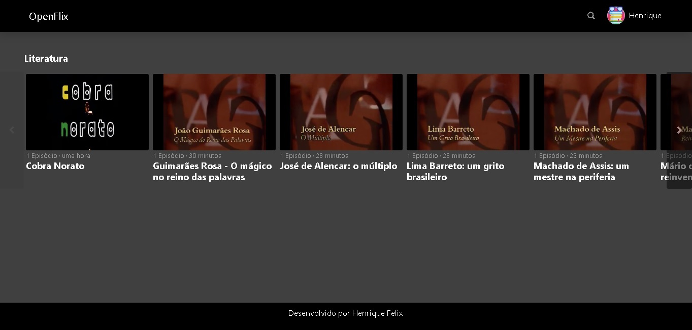

# OpenFlix
Projeto de um serviço de streaming (estilo Netflix, HBO Max, etc.) com vídeos de domíio público para a finalização do bootcamp Fullstack Unimed-BH da DIO

## Planejamento
Link para o projeto de planejamento no Miro: https://miro.com/app/board/uXjVOnT-DJw=/?share_link_id=862132376158

Link para o protótipo no Figma: https://www.figma.com/file/myO9d9R68jJQpfCFxHNnLK/OpenFlix?node-id=8%3A2